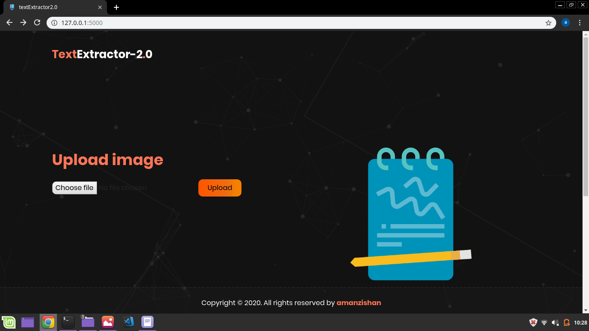
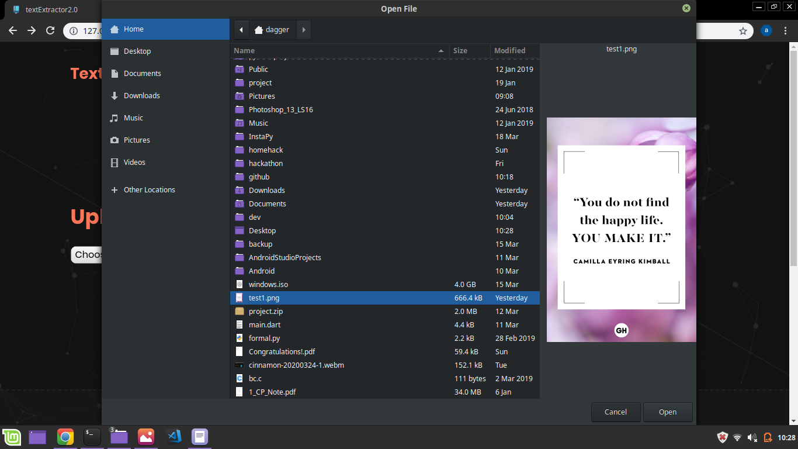
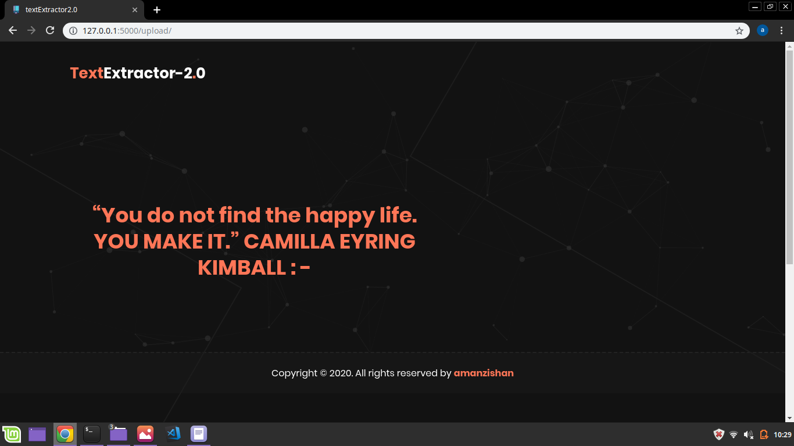
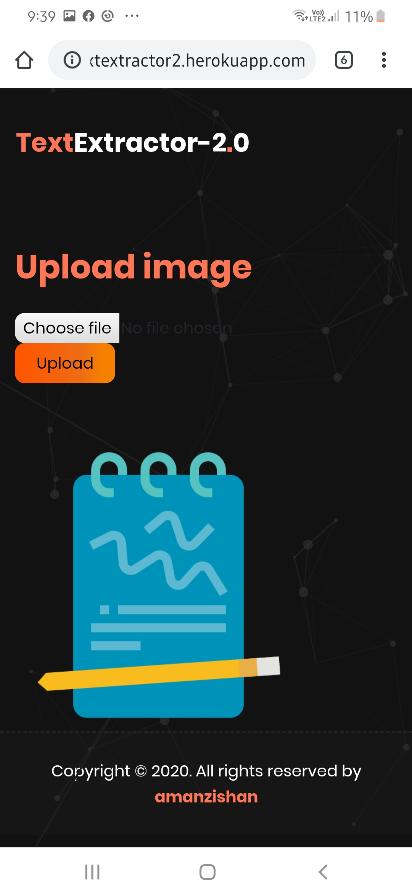
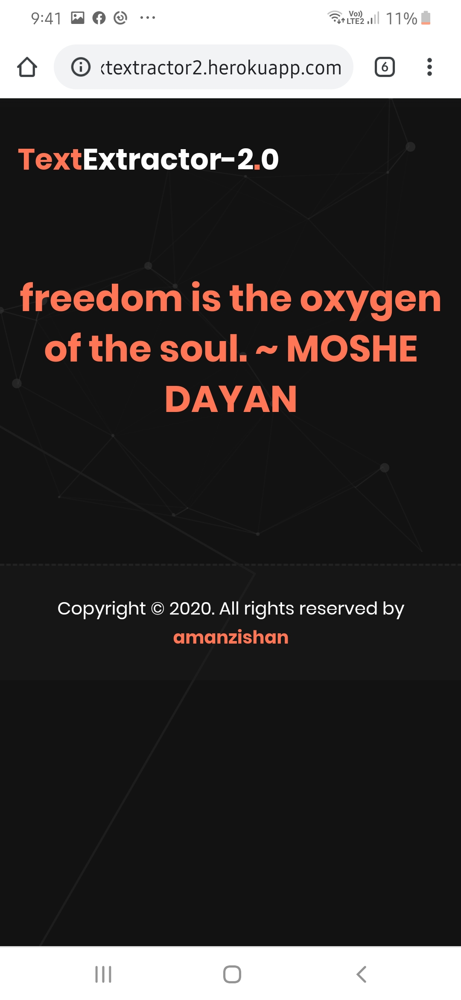

# textextractor2.0 :sparkles:
This webApp extracts the text from an image :heart_eyes:

 <h3> Tech stack used: :octocat: </h3>

<li>Visual Code Studio</li>
<li>python:snake:</li>
<li>flask:hot_pepper:</li>


<h3>Installation :gem: </h3>

1. **:round_pushpin: clone the repository.**

   ```shell
   $git clone https://github.com/Aman-zishan/textextractor2.0.git

   ```
2. **:checkered_flag: navigate to downloaded folder.**

   ```shell
   $cd textextractor2.0

   ```
3. **:construction: set up virtual environment.**

   ```shell
   #windows
   
   $py -3 -m venv venv
   
   #linux/mac OS
   
   $python3 -m venv venv

   ```
4. **:diamonds: activate virtual environment.**

   ```shell
   #windows

   $venv\Scripts\activate
   
   #linux/mac OS
   
   $source venv/bin/activate

   ```
5. **:hot_pepper: install flask**
    ```shell
    
    #windows
    
   $pip install flask
   
   #linux/mac OS
   
   $pip3 install flask

   ```
6. **:dart: setup flask environment and run app**
    ```shell
    
   $export FLASK_APP=app.py
   $export FLASK_ENV=development
   $flask run
   ```
   <p align="center">
 
 
 
 </p>
   <p align="center">
 
 
 

 </p>


