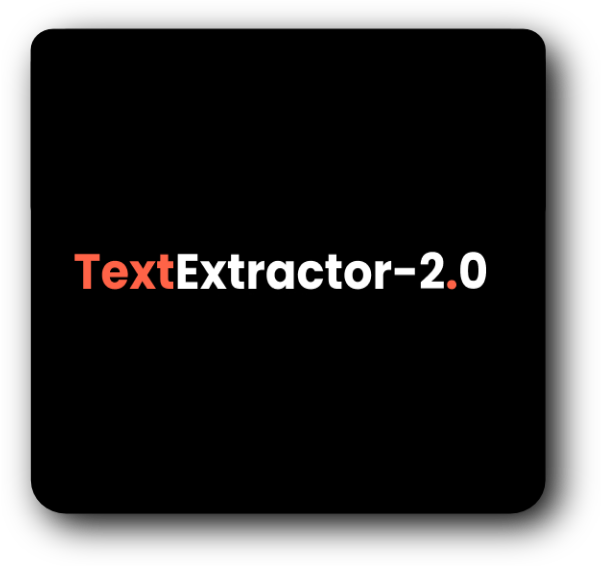
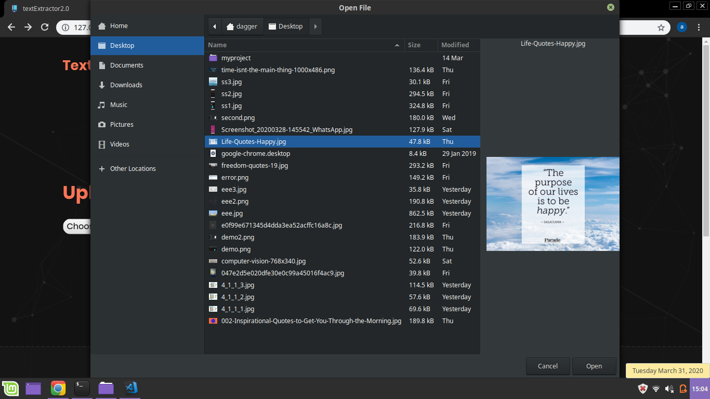
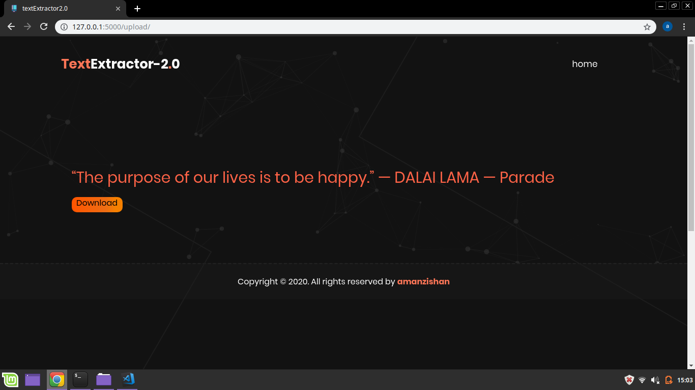

<p align="center">
 
 </p>


<div align="center">

[](https://travis-ci.com/Aman-zishan/textextractor2.0)
[](https://GitHub.com/Aman-zishan/textextractor2.0/issues/)
[](http://perso.crans.org/)
[](https://github.com/Aman-zishan/textextractor2.0/issues)
[](https://www.python.org/)
[](https://github.com/Aman-zishan/textextractor2.0/blob/master/LICENSE)

</div>

<h3> Tech stack used: :octocat: </h3>

<li>Visual Code Studio</li>
<li>python:snake:</li>
<li>flask:hot_pepper:</li>


<h3>Installation :gem: </h3>

1. **:round_pushpin: clone the repository.**

   ```shell
   $git clone https://github.com/Aman-zishan/textextractor2.0.git

   ```
2. **:checkered_flag: navigate to downloaded folder.**

   ```shell
   $cd textextractor2.0

   ```
3. **:construction: set up virtual environment.**

   ```shell
   #windows
   
   $py -3 -m venv venv
   
   #linux/mac OS
   
   $python3 -m venv venv

   ```
4. **:diamonds: activate virtual environment.**

   ```shell
   #windows

   $venv\Scripts\activate
   
   #linux/mac OS
   
   $source venv/bin/activate

   ```
5. **:hot_pepper: install flask & other required dependencies**
    ```shell
    
    #windows
    

   $pip install -r requirements.txt
   
   #linux/mac OS
   
  
   $pip3 install -r requirements.txt

   ```
  
  **Tesseract installation - for Windows OS**
  ```
  C:\Program Files\Tesseract-OCR\tesseract.exe is not installed or it's not in your path
  ```
  - If you get this error its probably because you dont have tesseract installed or not have set it to right path as per line 11 in `app.py`.
  - The soln for this is to install tesseract to the specified path in the code from [here](https://github.com/UB-Mannheim/tesseract/wiki)

6. **:dart: setup flask environment and run app**
    ```shell

    #windows
    
   $set FLASK_APP=app.py
   $set FLASK_ENV=development
   $flask run

   #linux/mac OS

   $export FLASK_APP=app.py
   $export FLASK_ENV=development
   $flask run
   ```
 # Demo :blush:
   <p align="center">
 
 
 
 </p>
 
 ## CONTRIBUTION

 <p align="center"></p>

Hacktoberfest® is open to everyone in our global community. Whether you’re a developer, student learning to code, event host, or company of any size, you can help drive growth of open source and make positive contributions to an ever-growing community. All backgrounds and skill levels are encouraged to complete the challenge.

Go through the [guidelines](https://github.com/Aman-zishan/textextractor2.0/blob/master/CONTRIBUTING.md) and feel free to contribute to this open source project!


